# Laporan Praktikum Basis Data - Pertemuan 1

**Nama:** Nia Septiana
**NIM:** 25430080
**Kelas:** C
**Tanggal:** 06 Oktober 2026
**Dosen Pengampu:** Dedi Irawan, S.Kom, M.T.I


## 1. Tujuan Praktikum

- Menjalankan layanan MariaDB lewat XAMPP Control Panel dan membaca status serta port 3306.
- Terhubung ke server melalui CLI `mysql` dan phpMyAdmin, serta memahami perbedaan keduanya.
- Mengamankan akun `root` dengan password dan membuat akun kerja yang haknya terbatas pada satu basis data.
- Membuat basis data pertama dan mencatat pekerjaan ke repositori Git yang terhubung ke GitHub.

## 2. Ringkasan Dasar Teori
DBMS merupakan perangkat lunak untuk menyimpan, mengelola, menjaga integritas, dan mengamankan data. MariaDB menggunakan arsitektur klien-server, dengan server `mysqld` yang menerima perintah dari klien seperti CLI `mysql` dan phpMyAdmin melalui port 3306.

CLI lebih sesuai untuk menjalankan skrip SQL yang dapat diulang dan disimpan di Git, sedangkan phpMyAdmin memudahkan pengelolaan data secara visual. MariaDB menggunakan akun `pengguna@host` dengan prinsip *least privilege*, yaitu memberikan hak akses sesuai kebutuhan. Git digunakan untuk menyimpan skrip sekaligus mencatat proses pengerjaan.


## 3. Hasil Langkah Percobaan

### 3.1 Menjalankan layanan MariaDB (D.1)

Modul MySQL dijalankan lewat XAMPP Control Panel. Modul berubah hijau dan kolom *Port(s)* menampilkan 3306, yang berarti server siap menerima koneksi.

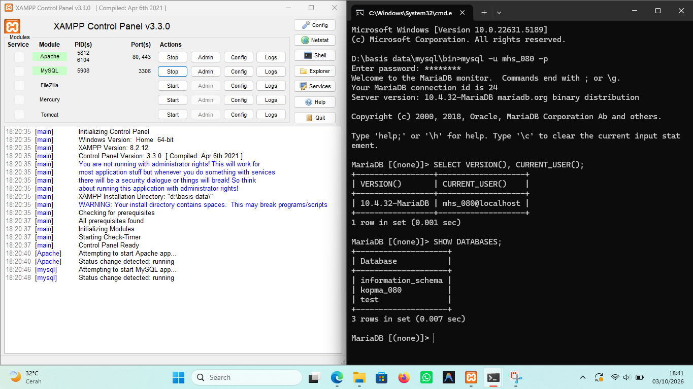

### 3.2 Masuk lewat CLI (D.2)

Command Prompt dibuka di folder `mysql\bin` XAMPP. Percobaan `mysql -u root` tanpa `-p` ditolak dengan ERROR 1045 (`using password: NO`), lalu `mysql -u root -p` berhasil. Kueri `SELECT VERSION(), CURRENT_USER();` menampilkan versi `10.4.32-MariaDB` dan akun `root@localhost`.

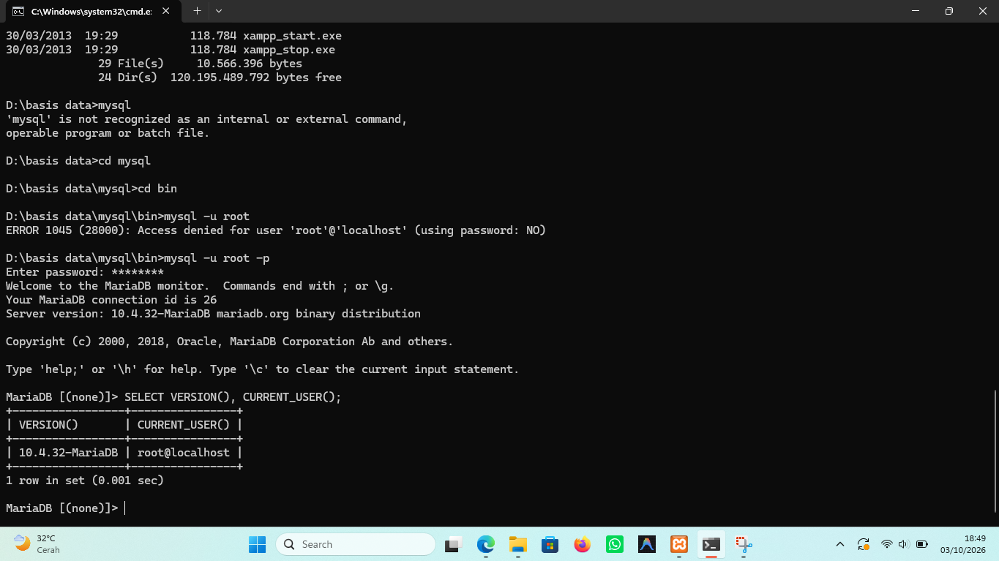

Kueri berikutnya memeriksa daftar basis data dan mode SQL:

```sql
SELECT VERSION(), CURRENT_USER();
SHOW DATABASES;
SELECT @@sql_mode;
```

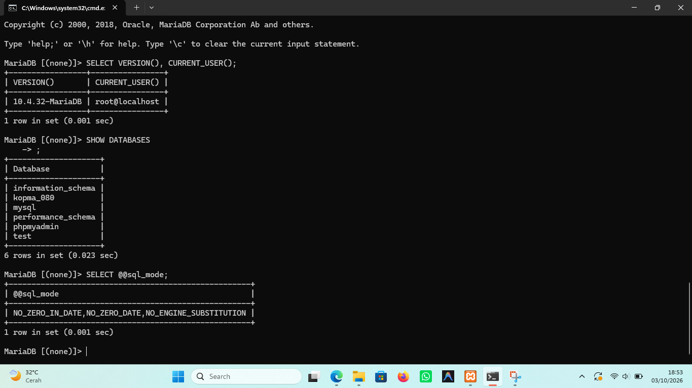

`SHOW DATABASES` menampilkan `information_schema`, `kopma_080`, `mysql`, `performance_schema`, `phpmyadmin`, dan `test`.

Nilai `@@sql_mode` yang muncul adalah `NO_ZERO_IN_DATE,NO_ZERO_DATE,NO_ENGINE_SUBSTITUTION`. 


### 3.3 Mengamankan akun root (D.3)

Akun `root` diberi password. Semua baris `root` pada `mysql.user` harus diberi password yang sama:

```sql
SELECT User, Host FROM mysql.user WHERE User = 'root';
ALTER USER 'root'@'localhost' IDENTIFIED BY '<password_root>';
ALTER USER 'root'@'127.0.0.1' IDENTIFIED BY '<password_root>';
ALTER USER 'root'@'::1'       IDENTIFIED BY '<password_root>';
```
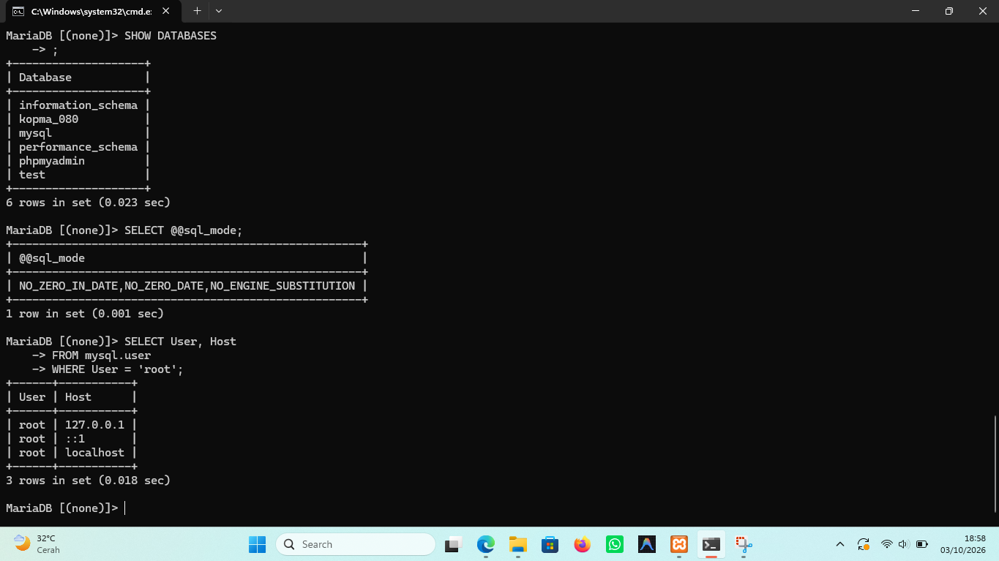

### 3.4 Membuat basis data dan akun kerja (D.4)

```sql
CREATE DATABASE kopma_080
  CHARACTER SET utf8mb4 COLLATE utf8mb4_unicode_ci;
CREATE USER 'mhs_080'@'localhost' IDENTIFIED BY '<password_kerja>';
GRANT ALL PRIVILEGES ON kopma_080.* TO 'mhs_080'@'localhost';
SHOW GRANTS FOR 'mhs_080'@'localhost';
```

Basis data `kopma_080` sudah terlihat pada daftar `SHOW DATABASES` di butir 3.2.

> 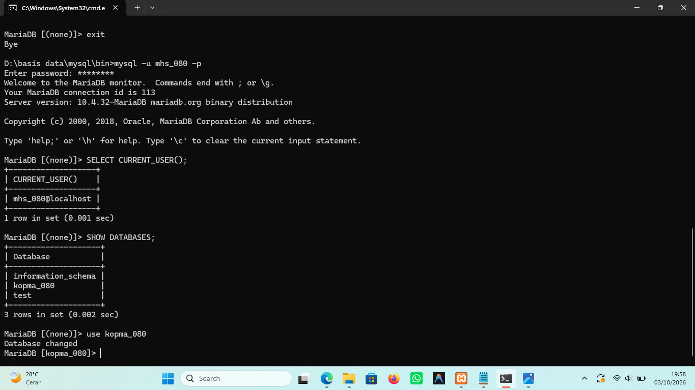

### 3.5 Menggunakan phpMyAdmin dengan aman (D.5)

Pada `C:\xampp\phpMyAdmin\config.inc.php`, nilai `auth_type` diubah dari `'config'` menjadi `'cookie'`:

```php
$cfg['Servers'][$i]['auth_type'] = 'cookie';
```

Sekarang phpMyAdmin menampilkan halaman login dan pengguna mengisi username/password sendiri. Pada gambar berikut masuk sebagai `mhs_080`:

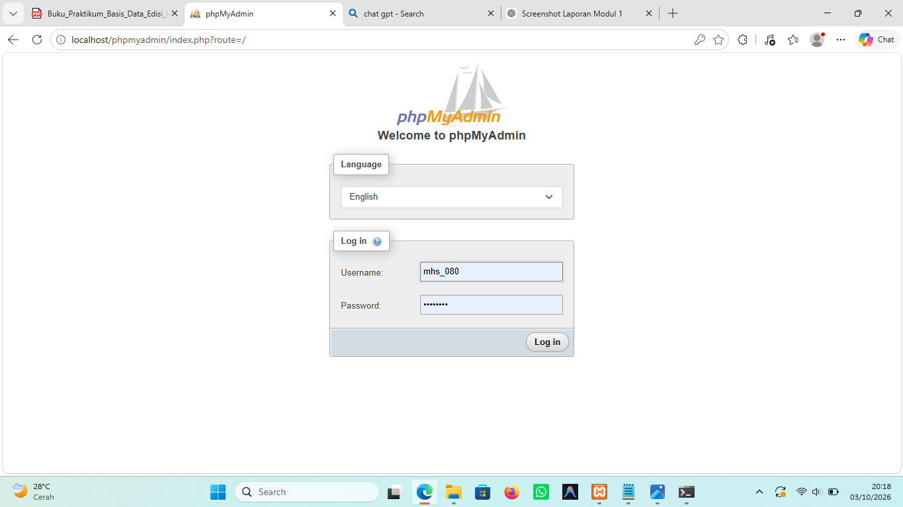

## 4. Jawaban Titik Analisis

**Titik Analisis 1.**

Meskipun di XAMPP tertulis "MySQL", server yang digunakan sebenarnya adalah MariaDB 10.4.32. Oleh karena itu, saat mengatasi masalah, sebaiknya mengacu pada dokumentasi MariaDB, sedangkan dokumentasi MySQL dapat digunakan untuk sintaks dasar yang serupa.

**Titik Analisis 2.** 

Setelah `root` berpassword, `mysql -u root` tanpa `-p` menghasilkan `ERROR 1045 (28000): Access denied for user 'root'@'localhost' (using password: NO)`. Bagian yang menunjukkan bahwa klien tidak mengirim password adalah `using password: NO`. Jika passwordnya salah, pesannya menjadi `using password: YES`. Login yang benar adalah `mysql -u root -p`.

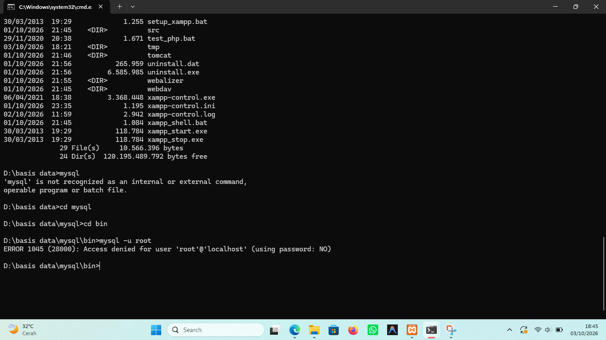

**Titik Analisis 3.** 

`information_schema` tetap terlihat oleh `mhs_080` karena isinya hanya metadata dan struktur server, yang memang bisa dibaca semua akun. Basis data `mysql` ditolak dengan ERROR 1044 karena `mhs_080` tidak punya hak atas basis data itu. Kode 1044 berarti akun berhasil masuk tetapi tidak berhak atas basis data yang dituju, sedangkan 1045 berarti proses autentikasinya sendiri gagal (password salah atau tidak dikirim).
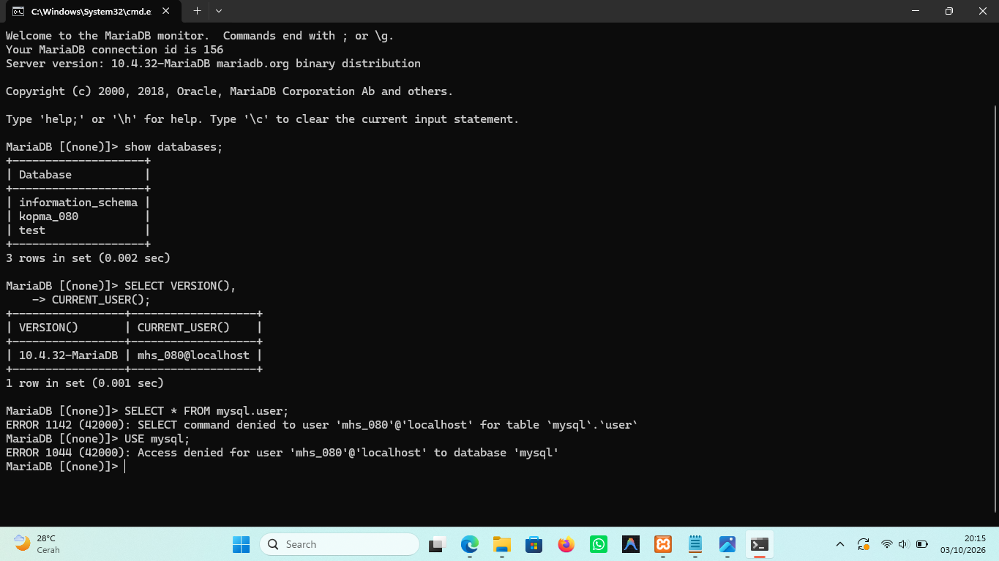

**Titik Analisis 4.** 

Mode `cookie` lebih aman daripada `config` karena pengguna harus mengetik username dan password setiap kali masuk. Pada mode `config`, kredensial tersimpan di berkas konfigurasi dan phpMyAdmin masuk otomatis, sehingga siapa pun yang membuka `http://localhost/phpmyadmin` langsung memegang hak akun tersebut.

**Perbedaan galat 1044, 1045, dan 1142**

| Kode galat | Makna | Contoh dalam praktikum |
|---|---|---|
| 1044 | Akun dikenali, tetapi tidak berhak atas **basis data** yang dituju | `mhs_080` menjalankan `USE mysql;` |
| 1045 | **Autentikasi** gagal: password salah atau tidak dikirim | `mysql -u root` tanpa `-p` |
| 1142 | Akun sudah masuk, tetapi tidak berhak menjalankan **perintah** tertentu pada objek tersebut | `tamu_080` menjalankan `CREATE TABLE uji` |

## 5. Hasil Latihan dan Modifikasi

- Pembuatan akun tamu (tamu_080) dengan hak akses SELECT-only pada basis data koperasi (kopma_080),serta pengujian CREATE TABLE yang menghasilkan ERROR 1142
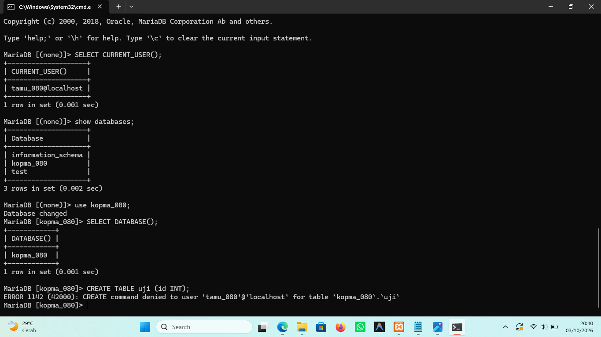
- Menyesuaikan skrip agar dapat dijalankan berulang kali menggunakan IF NOT EXISTS
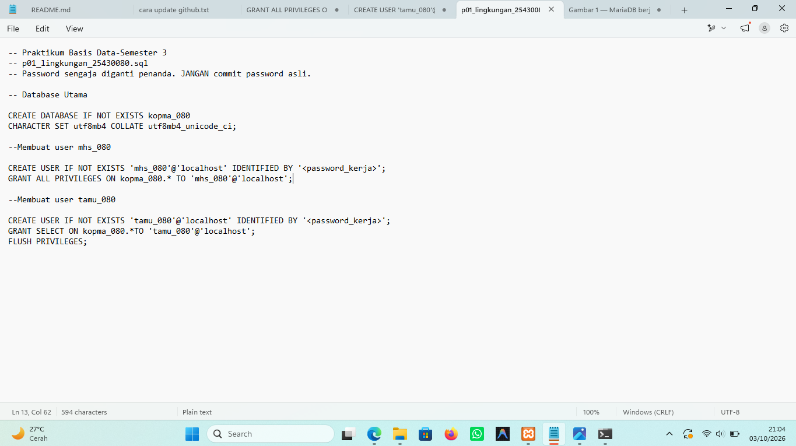

## 6. Tugas Mandiri: Milestone Proyek 1

Pada milestone ini saya menyiapkan fondasi proyek **Akademik Cendekia NS**, yaitu basis data `akad_080`, akun pengembang `dev_080`, dan repositori Git sebagai tempat seluruh pekerjaan dicatat sampai UAS.
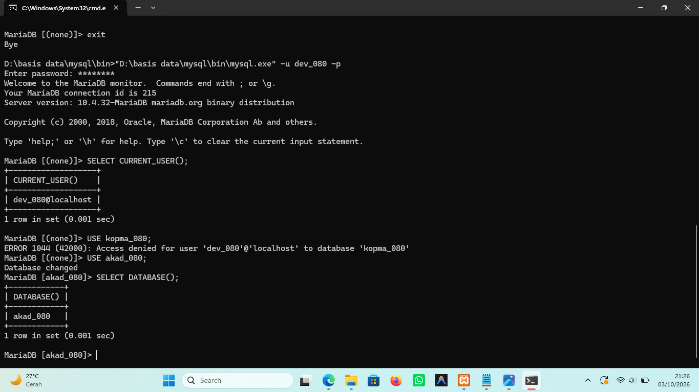

Berkas yang disiapkan di repositori:

- `p01_lingkungan_25430080.sql`: skrip pembuatan basis data dan akun, yang dapat dijalankan ulang
- `README.md`: identitas proyek (tema Akademik, kode tema `akad`) dan lingkup layanan organisasi
- `.gitignore`: mengecualikan berkas kredensial (`*.env`, `kredensial*.txt`)
- `laporan/p01_laporan_25430080.md`: laporan Pertemuan 1

## 7. Pembahasan dan Kendala

Selama praktikum berlangsung, terdapat beberapa kendala dalam memahami perbedaan hak akses setiap pengguna serta arti dari kode kesalahan pada MySQL. Setelah dilakukan pengujian lebih lanjut, diketahui bahwa setiap kode kesalahan memiliki kondisi dan penyebab yang berbeda.

Selain itu, proses menyiapkan dan melakukan push berkas ke repositori membutuhkan ketelitian agar seluruh hasil praktikum dapat tersimpan dengan lengkap dan sesuai.


## 8. Kesimpulan

Dalam praktikum ini aku menyiapkan lingkungan kerja MariaDB di XAMPP, mengamankan akun `root`, dan membuat akun kerja yang haknya terbatas sesuai prinsip *least privilege*. Dari galat 1044, 1045, dan 1142 aku jadi bisa membedakan masalah autentikasi, hak atas basis data, dan hak atas perintah. Proyek Akademik Cendekia NS juga sudah dimulai dengan basis data `akad_080`, README, dan `.gitignore` di repositori Git.

## 9. Pernyataan Penggunaan AI

AI dimanfaatkan sebagai alat bantu dalam memahami petunjuk praktikum, memperjelas materi atau konsep yang masih kurang dipahami, serta mendukung proses penyusunan laporan. Seluruh isi laporan dan bukti yang dicantumkan tetap berdasarkan hasil praktikum yang telah dilakukan secara langsung.


## 10. Bukti Git

- **Repositori:** https://github.com/niaseptiana/basisdata_25430080
- **Commit hash:** `[cbb1797]` 

## Checklist Laporan Pertemuan 1

- [x] `p01_lingkungan_25430080.sql` tersedia dan dapat dijalankan ulang
- [x] `README.md` berisi Identitas Proyek
- [x] `.gitignore` tersedia
- [x] Screenshot `SELECT VERSION(), CURRENT_USER();`
- [x] Screenshot `SELECT @@sql_mode;`
- [x] Screenshot `SHOW DATABASES;`
- [x] Database `kopma_080` dan akun `mhs_080` tersedia
- [x] Database `akad_080` dan akun `dev_080` tersedia
- [x] Bukti galat 1044
- [x] Bukti galat 1045
- [x] Bukti galat 1142
- [x] Bukti halaman masuk phpMyAdmin mode cookie
- [x] Titik Analisis 1
- [x] Titik Analisis 2
- [x] Titik Analisis 3
- [x] Titik Analisis 4
- [x] Perbedaan kode galat 1044, 1045, dan 1142

