# Laporan Praktikum Basis Data - Pertemuan 2

**Nama:** Nia Septiana
**NIM:** 25430080
**Kelas:** C
**Tanggal:** 06 Oktober 2026
**Dosen Pengampu:** Dedi Irawan, S.Kom, M.T.I

## 1. Tujuan Praktikum

Praktikum ini bertujuan untuk memahami cara menganalisis kebutuhan data sebelum membuat rancangan basis data.
Hal yang dianalisis meliputi proses bisnis, aktor, dokumen sumber, entitas, aturan bisnis, kebutuhan informasi, CRUD, kamus data, kebutuhan non-fungsional, dan masalah kualitas data.
Praktikum terdiri dari latihan menggunakan tema **Koperasi Mahasiswa Sejahtera (Kopma)** dan tugas mandiri menggunakan tema **Akademik Cendekia NS**.

## 2. Ringkasan Dasar Teori

Analisis kebutuhan data digunakan untuk menentukan data apa saja yang dibutuhkan oleh suatu organisasi.
Dalam prosesnya, perlu diketahui siapa yang menggunakan data, bagaimana proses bisnis berjalan, data apa yang disimpan, aturan yang berlaku, serta informasi apa yang perlu dihasilkan.
Matriks CRUD digunakan untuk melihat hubungan proses bisnis dengan entitas melalui operasi **Create, Read, Update, dan Delete**. Kamus data digunakan untuk menjelaskan setiap elemen data yang digunakan.

## 3. Hasil Langkah Percobaan

### 3.1 Latihan Tema Kopma

Pada latihan digunakan studi kasus **Koperasi Mahasiswa Sejahtera (Kopma)** yang menjual alat tulis, makanan ringan, dan minuman.
Proses bisnis yang diperoleh meliputi pendaftaran anggota, penjualan, pemesanan barang, penerimaan barang, laporan bulanan, pengelolaan pemasok, barang, status anggota, dan petugas.
Entitas yang digunakan antara lain Anggota, Barang, Penjualan, Detail Penjualan, Petugas, Pemasok, Pembelian, dan Mutasi Poin.
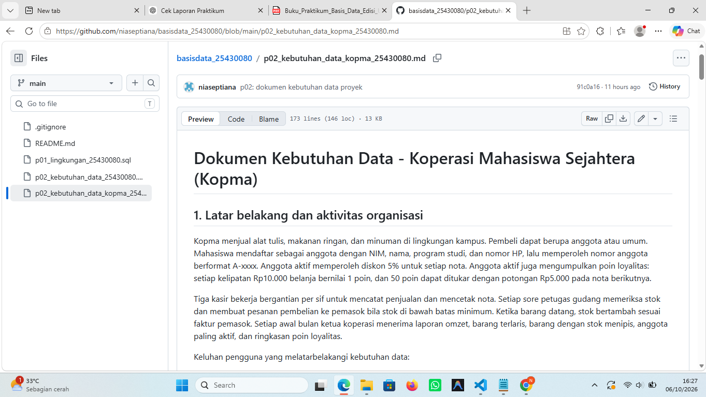
Tampilan file `p02_kebutuhan_data_kopma_25430080.md`.

### 3.2 Modifikasi Poin Loyalitas

Pada Kopma ditambahkan fitur poin loyalitas. Anggota aktif mendapatkan **1 poin setiap kelipatan Rp10.000** dari transaksi. Sebanyak **50 poin dapat ditukar dengan potongan Rp5.000**.
Setiap perubahan poin dicatat dalam mutasi poin agar riwayatnya dapat ditelusuri.
**Screenshot:** Bagian aturan poin dan mutasi poin.

### 3.3 Pemeriksaan CRUD Kopma

Matriks CRUD diperiksa untuk memastikan setiap entitas digunakan dalam proses bisnis. Dari pemeriksaan tersebut ditambahkan beberapa proses, yaitu pengelolaan pemasok, barang, status anggota, dan petugas.
Operasi Delete tidak digunakan karena data transaksi dan mutasi poin perlu disimpan untuk keperluan audit.
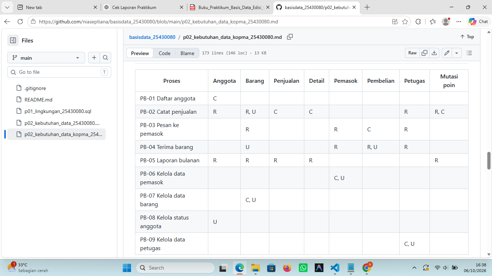
Matriks CRUD Kopma.

### 3.4 Perbaikan Kebutuhan

Kebutuhan yang masih terlalu umum diperjelas agar dapat diukur dan diuji. Contohnya kebutuhan mengenai keamanan, kecepatan pencarian, dan ketepatan laporan.

### 3.5 Proyek Akademik Cendekia NS

Untuk tugas mandiri digunakan proyek **Akademik Cendekia NS**. Sistem ini digunakan untuk mengelola data mahasiswa, dosen, mata kuliah, kelas, KRS, dan nilai.
Masalah yang diperhatikan antara lain perubahan kurikulum, perbedaan mata kuliah dan kelas, bentrok jadwal, serta kelas yang sudah penuh.
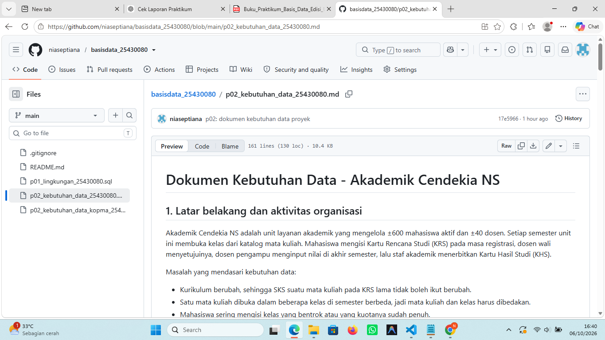
File `p02_kebutuhan_data_25430080.md` beserta identitas proyek.

### 3.6 Proses Bisnis Akademik

Terdapat empat proses utama:

| Kode  | Proses                          | Aktor                    |
| ----- | ------------------------------- | ------------------------ |
| PB-01 | Mengelola data mahasiswa        | Staf akademik            |
| PB-02 | Membuka kelas per semester      | Staf akademik            |
| PB-03 | Mengisi dan menyetujui KRS      | Mahasiswa dan dosen wali |
| PB-04 | Menginput nilai dan membuat KHS | Dosen dan staf akademik  |
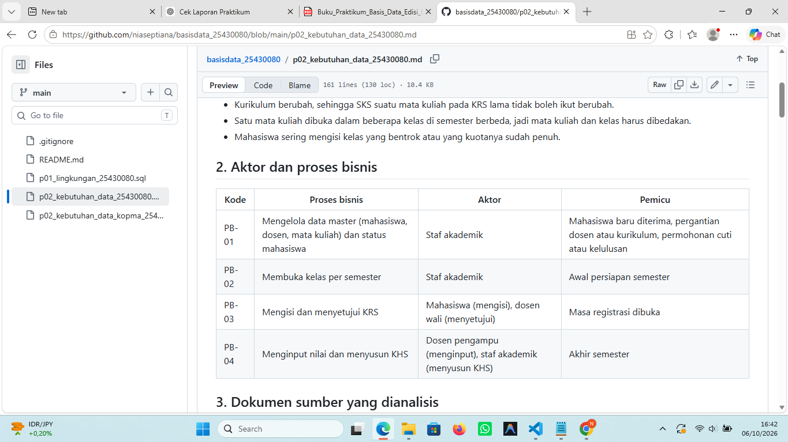
Tabel proses bisnis Akademik.

### 3.7 Dokumen Sumber

Dokumen sumber yang dibuat adalah **Kartu Rencana Studi (KRS)**. Data yang terdapat di dalamnya meliputi NIM, mahasiswa, semester, mata kuliah, kelas, SKS, jadwal, ruang, status, dan denda.
Total SKS merupakan data turunan yang diperoleh dari jumlah SKS pada detail KRS.
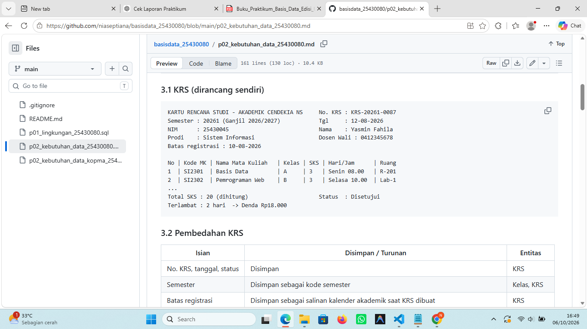
Dokumen KRS
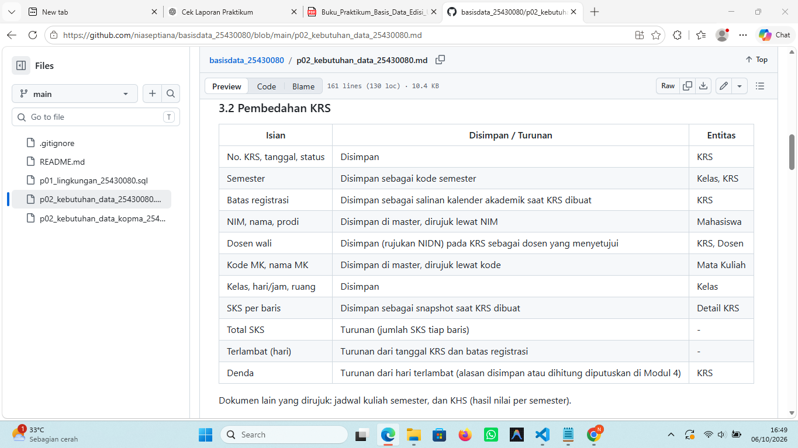
Hasil pembedahannya

### 3.8 Entitas Akademik

Enam entitas yang digunakan adalah:

1. Mahasiswa
2. Dosen
3. Mata Kuliah
4. Kelas
5. KRS
6. Detail KRS
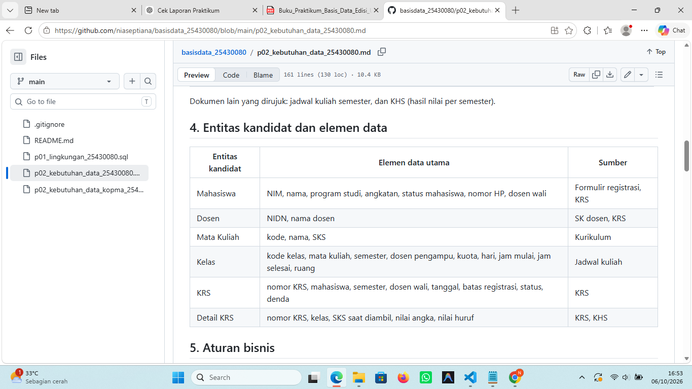
Bagian entitas kandidat.

### 3.9 Aturan Bisnis

Terdapat delapan aturan bisnis yang mengatur keunikan NIM, batas kelas dalam KRS, kuota kelas, bentrok jadwal, persetujuan KRS, denda keterlambatan, penyimpanan SKS, serta penilaian.
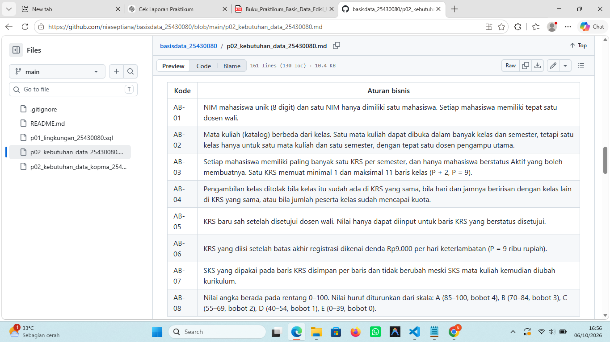
AB-01 sampai AB-08.

### 3.10 Kebutuhan Informasi

Informasi yang dibutuhkan meliputi:

* IPS dan IPK mahasiswa.
* Peserta dan sisa kuota kelas.
* Mahasiswa yang terlambat mengisi KRS dan jumlah denda.
* Jadwal kuliah mahasiswa.
* Distribusi nilai.
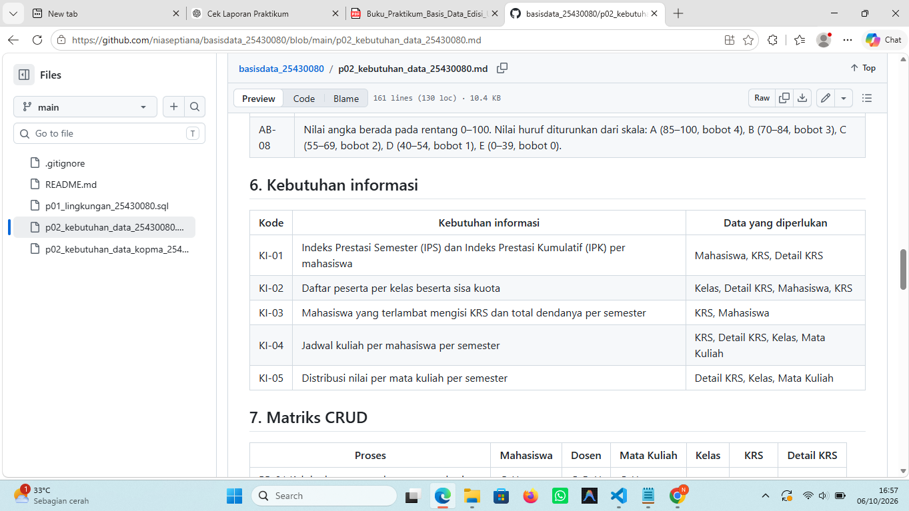
KI-01 sampai KI-05.

### 3.11 Matriks CRUD Akademik

Matriks CRUD digunakan untuk memastikan setiap entitas mempunyai hubungan dengan proses bisnis. Hasil pemeriksaan menunjukkan seluruh entitas telah memiliki proses Create.
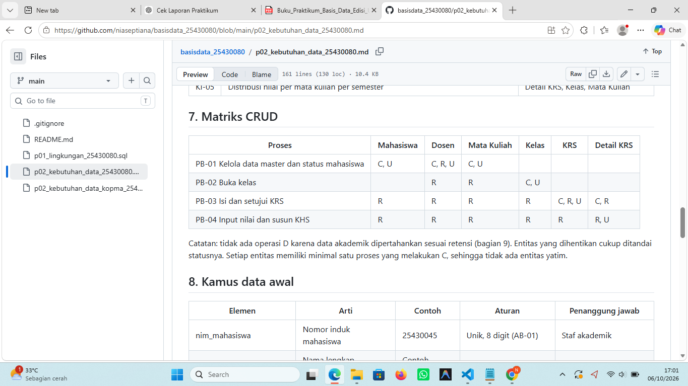
Matriks CRUD Akademik.

### 3.12 Kamus Data

Kamus data berisi lebih dari 20 elemen, seperti NIM, nama mahasiswa, program studi, NIDN, kode mata kuliah, SKS, kode kelas, jadwal, ruang, nomor KRS, tanggal KRS, status KRS, dan nilai.
Setiap data dilengkapi keterangan, contoh, aturan, dan penanggung jawab.
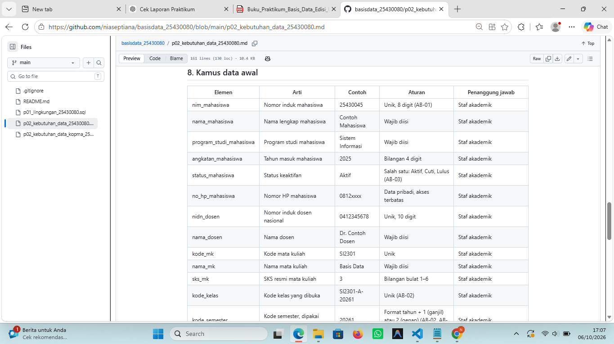
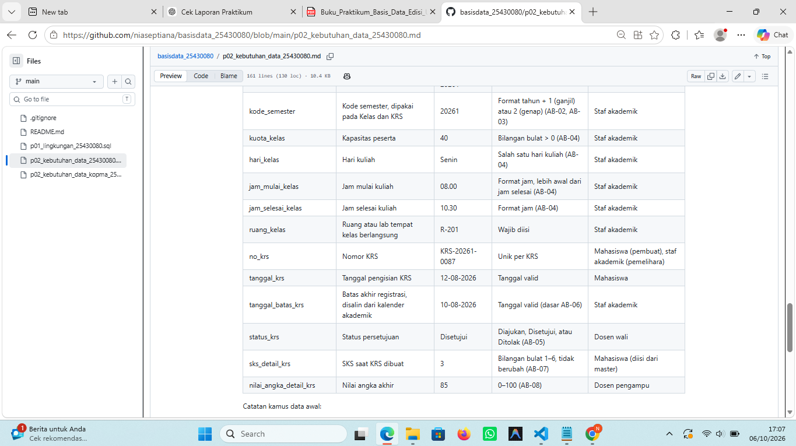
Tabel kamus data.

### 3.13 Kebutuhan Non-Fungsional

Parameter personal dihitung berdasarkan NIM 25430080:
**P = (80 mod 9) + 1 = 9**
Hasilnya:
* Maksimal **11 kelas dalam satu KRS**.
* Denda **Rp9.000 per hari**.
* Perkiraan **85 pengisian KRS per hari**.
* Data KRS dan nilai disimpan minimal **10 tahun**.
* Data pribadi hanya dapat diakses oleh pihak yang berwenang.
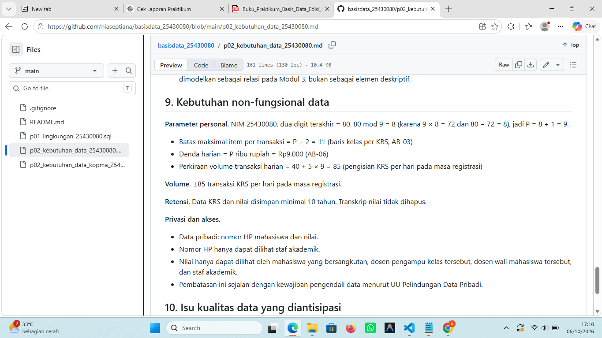
Perhitungan parameter personal.

### 3.14 Kualitas Data

Beberapa masalah yang mungkin terjadi adalah NIM duplikat atau salah, jadwal bentrok, kelas melebihi kuota, mahasiswa cuti yang masih mengisi KRS, perubahan SKS, ketidaksesuaian nilai angka dan huruf, serta perubahan dosen wali.

## 4. Jawaban Titik Analisis

**Titik Analisis 1:**
Pada Kopma, harga saat transaksi perlu disimpan agar perubahan harga tidak mengubah transaksi lama. Pada Akademik, SKS saat KRS dibuat juga perlu disimpan agar perubahan kurikulum tidak mengubah riwayat mahasiswa.

**Titik Analisis 2:**
Subtotal dan total dapat diperoleh dari perhitungan data detail, sehingga tidak wajib disimpan untuk mencegah perbedaan data apabila terjadi perubahan pada detail transaksi. Namun, total tetap dapat disimpan jika diperlukan sebagai catatan nilai transaksi yang sebenarnya dibayar atau tercatat. Keputusan mengenai penyimpanannya akan ditentukan pada tahap perancangan selanjutnya.

**Titik Analisis 3:**
Matriks CRUD digunakan untuk memastikan setiap entitas memiliki proses Create. Pada Kopma, beberapa entitas belum memiliki proses Create sehingga ditambahkan proses pengelolaan pemasok, barang, status anggota, dan petugas. Pada Akademik, semua entitas sudah memiliki proses Create.

## 5. Hasil Latihan dan Modifikasi

- Hasil latihan Kopma disimpan dalam:
`p02_kebutuhan_data_kopma_25430080.md`
Dokumen tersebut berisi proses bisnis, entitas, aturan bisnis, kebutuhan informasi, matriks CRUD, kamus data, kebutuhan non-fungsional, kualitas data, serta fitur poin loyalitas.
- Perbaikan Pernyataan Kebutuhan Kabur
  
  *a. “Data anggota harus aman.”*  
    Data anggota hanya dapat dilihat dan diubah oleh pengguna yang memiliki hak akses sesuai perannya. Pengguna tanpa hak akses tidak dapat membuka atau mengubah data anggota.

  *b. “Sistem harus cepat mencari barang.”*  
    Sistem harus menampilkan hasil pencarian barang berdasarkan kode atau nama dalam waktu maksimal 3 detik.

  *c. “Laporan stok harus akurat.”*  
    Setelah transaksi penjualan atau penerimaan barang diproses, jumlah stok pada laporan harus sama dengan jumlah stok yang tercatat pada data barang dan tidak boleh bernilai negatif.

## 6. Tugas Mandiri: Milestone Proyek 2

| Keterangan | Isi                              |
| ---------- | -------------------------------- |
| Nama       | Nia Septiana                     |
| NIM        | 25430080                         |
| Kelas      | C                                |
| Tema       | Akademik                         |
| Kode Tema  | `akad`                           |
| Database   | `akad_080`                       |
| Organisasi | Akademik Cendekia NS             |
| File       | `p02_kebutuhan_data_25430080.md` |

Proyek Akademik telah memenuhi kebutuhan Modul 2, yaitu minimal empat proses bisnis, enam entitas, delapan aturan bisnis, lima kebutuhan informasi, matriks CRUD, kamus data lebih dari 20 elemen, kebutuhan non-fungsional, dan isu kualitas data.

## 7. Pembahasan dan Kendala

Kegiatan Modul 2 terdiri dari dua bagian. Kopma digunakan sebagai latihan, sedangkan Akademik digunakan sebagai proyek utama.
Kendala yang ditemukan terutama saat memeriksa hubungan antara proses bisnis dan entitas pada matriks CRUD. Selain itu, perlu dibedakan antara data yang disimpan langsung dan data yang diperoleh dari perhitungan.

## 8. Kesimpulan

Dari latihan Kopma dan proyek Akademik, dapat diketahui proses bisnis, entitas, aturan, kebutuhan informasi, CRUD, kamus data, kebutuhan non-fungsional, dan masalah kualitas data. Hasil analisis ini dapat digunakan sebagai dasar untuk tahap perancangan basis data berikutnya.

## 9. Pernyataan Penggunaan AI

AI digunakan sebagai alat bantu untuk memahami instruksi, memeriksa struktur dokumen, dan membantu merapikan penyajian laporan. Isi dan keputusan dalam proyek tetap disesuaikan dengan hasil pengerjaan praktikum.

## 10. Bukti Git

Repository:
`https://github.com/niaseptiana/basisdata_25430080`

Commit Hash:
* 91c0a16defdbcc50c1e7c5cc903c6407c080f1b7 (p02_kebutuhan_data_kopma_25430080.md)
* 17e5966ae96af255881a1ca3fe1e13350cc88378 (p02_kebutuhan_data_25430080.md)

Berkas Modul 2:
* `p02_kebutuhan_data_kopma_25430080.md`
* `p02_kebutuhan_data_25430080.md`
* `laporan/p02_laporan_25430080.md`

## Checklist Laporan Pertemuan 2

- [x] `p02_kebutuhan_data_kopma_25430080.md` tersedia
- [x] `p02_kebutuhan_data_25430080.md` tersedia
- [x] Screenshot tabel PB tersedia
- [x] Screenshot tabel AB tersedia
- [x] Screenshot tabel KI tersedia
- [x] Screenshot matriks CRUD tersedia
- [x] Screenshot kamus data tersedia
- [x] Screenshot tampilan GitHub tersedia
- [x] Titik Analisis 1
- [x] Titik Analisis 2
- [x] Titik Analisis 3
- [x] Perhitungan parameter P
- [x] Perbaikan tiga pernyataan kebutuhan kabur